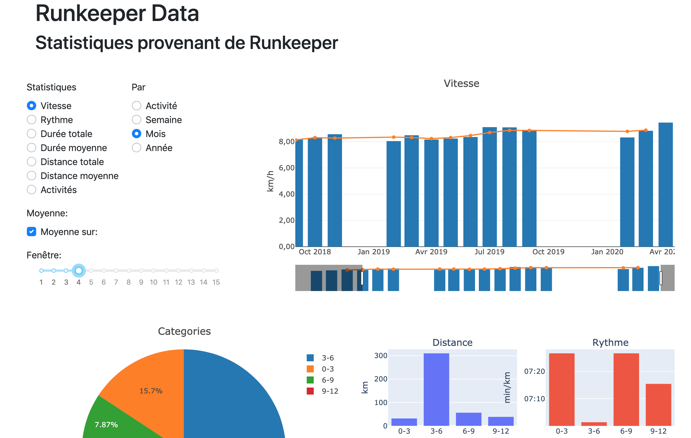
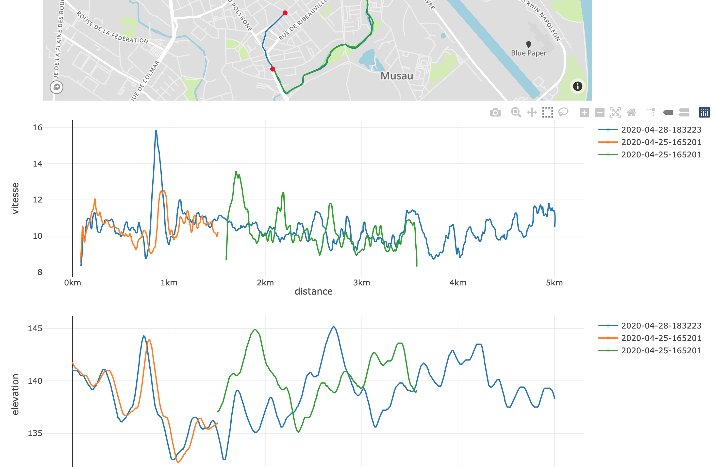

# Web page to display statistics on Runkeeper data

First, install plotly, with for example conda:

    conda create -n runkeeper-data python="3.8"
    conda activate runkeeper-data
    conda install -c plotly numpy pandas scipy plotly chart_studio
    pip install dash dash-bootstrap-components gpxpy

then get the address to download your data in your Runkeeper account, and run

    ./dl-data <address>

And launch the app with

    python app.py

which should give an address to visit with your browser where you have the different graphs and table.

